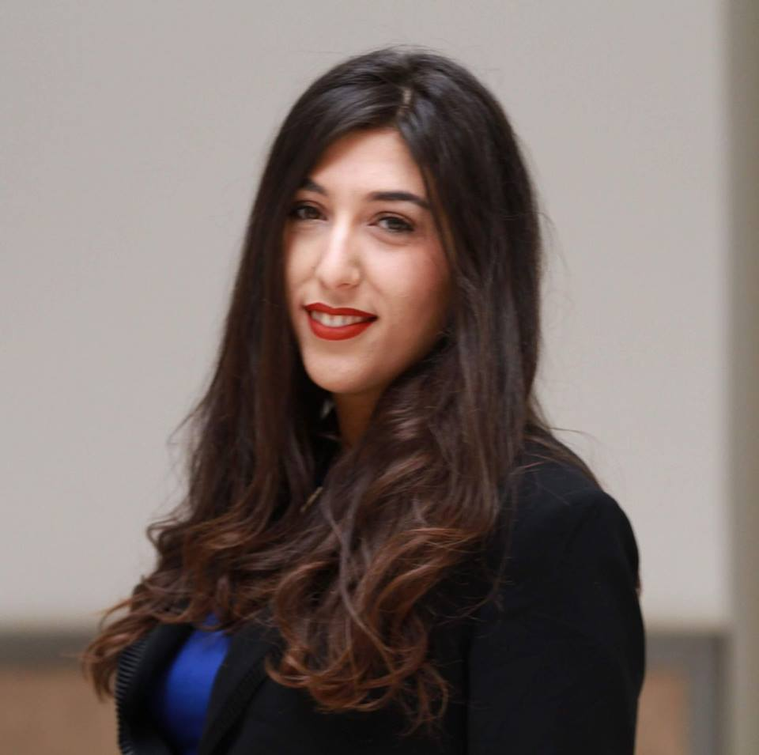

---
---

<link rel="stylesheet" href="styles.css" type="text/css">

I'm Yasmine Ben Taarit, I'm a student of Statistics at the [*Ecole Supérieure de la Statistique et de l'Analyse de l'Information*](http://www.essai.rnu.tn/accueil.htm) getting data science courses: Big Data, Computing tools for Statistics such as `R` and Python, Bayesian Statistics and Time Series.

I like using a lot `R`  and  Python for  Data Analysis and Exploring patterns. 

My full CV is available [here](CV.pdf).

If you have any comments, questions or suggestions feel free to [contact me](yasminebentaarit123@gmail.com) 

